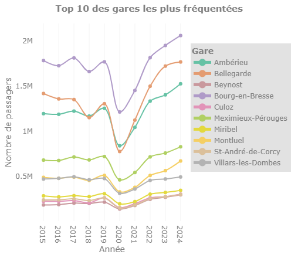
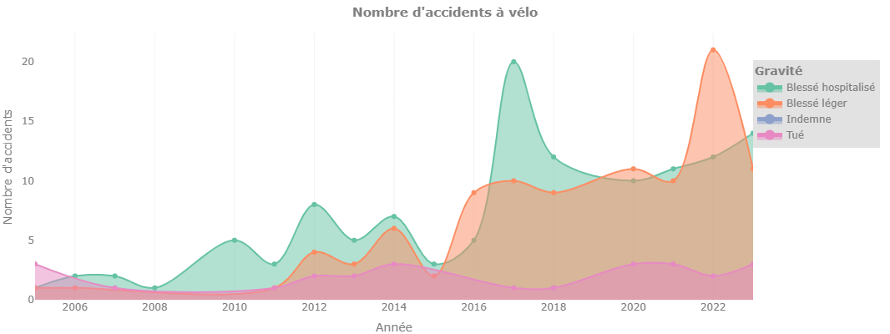
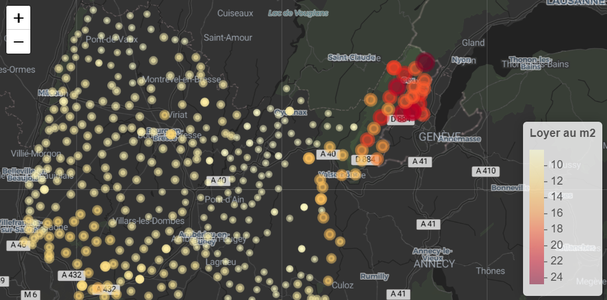

# Analyse du territoire de l’Ain


## Objectif

Cette application interactive [R Shiny](https://shiny.posit.co/) permet d’analyser l’accessibilité aux gares, les accidents de vélo et les loyers dans le département de l’Ain en les reliant à des variables socio-démographiques telles que la densité de population.

## Fonctionnalités

### Gares et accessibilité

- Cartographier les gares toujours actives dans le département avec une couche de densité de la population  et des zones isochrones : connaître les communes éloignées des mobilités douces.
- Évolution annuelle du nombre de passagers dans les 10 plus grandes gares de l'Ain
- Indicateurs liés au traffic :
  + Pourcentage de la population à moins de 10 minutes à vélo d'une gare.
  + Nombre de voyageurs en 2024.
  + Nombre de gares actives.
 


### Accidents de vélo

- Analyser l'**évolution des accidents de vélo** selon le niveau de gravité.
- Comprendre les facteurs qui influencent la gravité des accidents à vélo.
- Détecter les jours de la semaine les plus accidentogènes afin d’identifier les périodes et les saisons à risque et d’orienter les actions de prévention.



### Loyers
  
- Explorer la **répartition des montants des loyers** à l’échelle communale de 2018 à 2023, selon le type de logement.



## Méthode statistiques utilisé

Dans ce projet, la réduction de dimensions **FAMD** est appliquée pour analyser la gravité des accidents de vélo sur des variables quantitatives et factorielles comme :
- agglomération
- intersection
- type de collision
- lumière
- âge de la victime

Avant l’analyse, les valeurs manquantes (NA) sont imputées à l’aide de la fonction `imputeFAMD()` du package `missMDA`, qui estime les valeurs manquantes en tenant compte des relations entre variables.

## Structure du projet

- `app.R` : fichier principal de l’application Shiny contenant à la fois l’interface utilisateur (UI) et le serveur (server).  
- `global.R` : charge les packages nécessaires et les fonctions personnalisées.  
- `constants.R` : définit les variables globales utilisées dans toute l’application.  
- `data/` : dossier contenant les jeux de données bruts et nettoyés.  
- `functions/` : contient les fonctions de traitement, de visualisation et d’analyse statistique utilisées pour le pré-traitement des données.  
- `www/` : contient les images, icônes et autres ressources statiques.  
- `README.md` : fichier de documentation décrivant le projet.  

## Données

Les données utilisées dans ce projet proviennent de différentes sources ouvertes (open data, API) :

- Loyers par commune 2018-2023
- Communes de france
- Données socio-démographiques 2017
- Gares ferroviaires
- Fréquentation des gares
- Accidents de vélo
- API openroute service

## Libraries

```r
library(shiny)
library(bslib)
library(bsicons)
library(dplyr)
library(lubridate)
library(stringr)
library(leaflet)
library(leaflet.extras)
library(plotly)
library(sf)
library(tidyr)
library(grDevices)
library(DT)
library(crosstalk)
library(jsonlite)
library(scales)
library(RColorBrewer)
library(FactoMineR)
library(missMDA)
```

## Ré-utilisation


1. Installer [R](https://www.r-project.org/) et un IDE ([RStudio](https://posit.co/download/rstudio-desktop/) ou [Positron](https://positron.posit.co/))  
2. Installer les [packages requis](#libraries).  
3. Cloner ce dépôt Git en local.  
4. Exécuter les fichiers `.R` du dossier `functions/` pour charger les fonctions de pré-traitement des données.  
5. Exécuter le fichier `app.R` pour lancer l’application Shiny.

## Contact

- E-mail : [mathieu.boully@hotmail.com](mailto:mathieu.boully@hotmail.com)  
- LinkedIn : [Ton profil LinkedIn](https://www.linkedin.com/in/ton-profil)  
