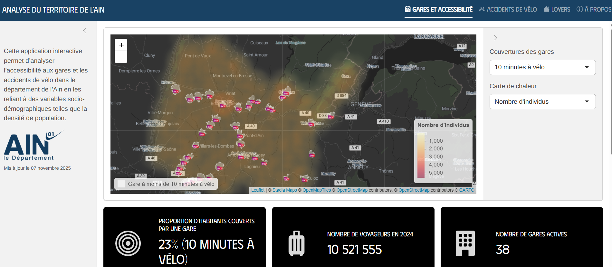

# Analyse du territoire de l’Ain

## Objectif

Cette application interactive [R Shiny](https://shiny.posit.co/) permet d’analyser l’accessibilité aux gares, les accidents de vélo et les loyers dans le département de l’Ain en les reliant à des variables socio-démographiques telles que la densité de population.

## Fonctionnalités

### Accidents de vélo

- Analyser l'**évolution des accidents de vélo** selon le niveau de gravité.
- Comprendre les facteurs qui influencent la gravité des accidents à vélo.
- Détecter les jours de la semaine les plus accidentogènes afin d’identifier les périodes et les saisons à risque et d’orienter les actions de prévention.

### Gares et accessibilité

- Cartographier les gares toujours actives dans le département avec une couche de densité de la population  et des zones isochrones : connaître les communes éloignées des mobilités douces.
- Indicateurs liés au traffic :
  + Pourcentage de la population à moins de 10 minutes à vélo d'une gare.
  + Nombre de voyageurs en 2024.
  + Nombre de gares actives.

  ### Loyers
  
  - Explorer la **répartition des montants des loyers** à l’échelle communale de 2018 à 2023, selon le type de logement.

## Méthodes statistiques

Dans ce projet, la réduction de dimensions **FAMD** est appliquée sur des variables quantitatives et factorielles comme :
- agglomération
- intersection
- type de collision
- lumière
- âge de la victime

Avant l’analyse, les valeurs manquantes (NA) sont imputées à l’aide de la fonction `imputeFAMD()` du package `missMDA`, qui estime les valeurs manquantes en tenant compte des relations entre variables.



## Contenu du projet

- `app.R` : fichier principal de l’application Shiny
- `data/` : dossiers contenant les jeux de données
  - **Loyers** : [Open Data - Carte des loyers 2023](https://www.data.gouv.fr/datasets/carte-des-loyers-indicateurs-de-loyers-dannonce-par-commune-en-2023/)
  - **Accidents vélo** : fichier CSV ou GeoJSON
- `www/` : fichiers CSS, images ou icônes
- `utils.R` : fonctions R pour le traitement et la visualisation (optionnel)
- `README.md` : ce fichier explicatif

---

## 🖥️ Installation et lancement

1. Installer R et RStudio.
2. Installer les packages requis :

```r
install.packages(c(
  "shiny", "leaflet", "dplyr", "ggplot2", 
  "scales", "DT", "stringr", "shinydashboard", "shinyWidgets"
))
